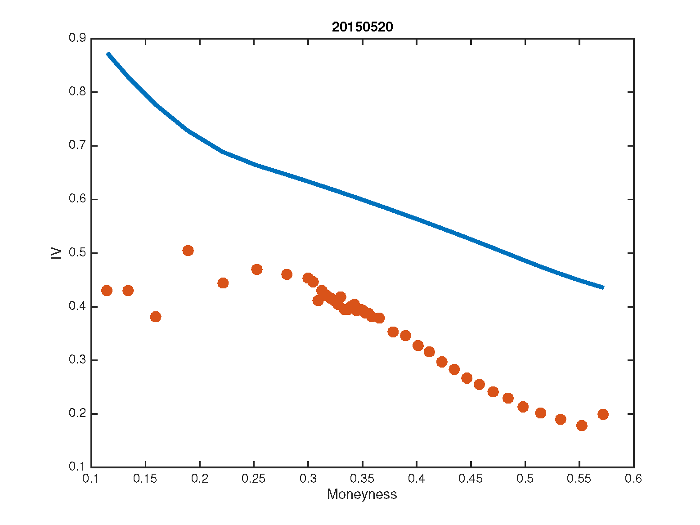
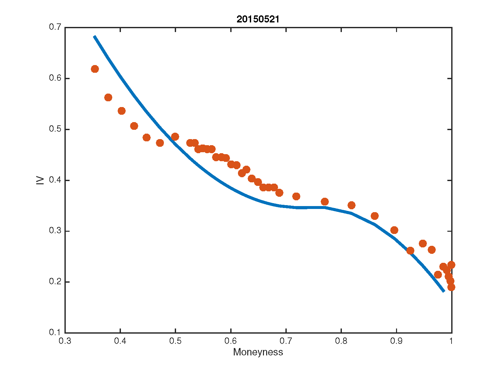

[](http://quantlet.de/index.php?p=info)

## [](http://quantlet.de/) **LETFIVTrueMonsc** [](http://quantlet.de/d3/ia)

```yaml

Name of Quantlet : LETFIVTrueMonsc

Published in : Leveraged ETF options implied volatility paradox

Description : 'Compute and plot the true SSO LETF option and moneyness-scaling predicted IV via the
dynamic semiparametric factor model with B-spline basis for specific time-to-maturity points'

Keywords : 'DSFM, dynamic, semiparametric, semiparametric model, pca, principal-component-analysis,
factor, factor-model, spline, basis, option, implied-volatility, surface, Newton'

See also : LETFFactorFuncs, LETFIVSurfPlot, LETFStochLoads

Author : Sergey Nasekin

Submitted : 2016/01/21

Datafile : SPYMAT.mat, SSOMAT.mat

Input: 
- Km: B-spline order in moneyness direction
- Kt: B-spline order in time-to-maturity direction
- dim_mon: number of grid points for estimation in moneyness direction
- dim_ttm: number of grid points for estimation in time-to-maturity direction
- ikmon: parameter for setting the number of B-spline knots in moneyness direction
- ikttm: parameter for setting the number of B-spline knots in time-to-maturity direction
- tol: convergence tolerance for the Newton method
- maxiter: maximal number of iterations for the Newton method
- L: number of factor functions in the model
- beta1: leverage ratio
- c: LETF expense ratio

Output: 
- Plot 1: 'true SSO LETF option (red dots) and moneyness-scaling predicted IV for TTM 0.8 years on
20150520'
- Plot 2: 'true SSO LETF option (red dots) and moneyness-scaling predicted IV for TTM 0.8 years on
20150521'

```






```matlab
%% LOAD DATA AND SET PARAMETERS

%Clear workspace and close all windows 
clc
clear
close all

%Set the model parameters
Km         = 3; 
Kt         = 3;
dim_mon    = 70;
dim_ttm    = 70;
ikmon      = 5;
ikttm      = 3;
tol        = 1e-06;
maxiter    = 100;
L          = 3;
beta1      = 2;
c          = 0.0089;

%Load data for SPY, SSO options  
load SPYMAT
load SSOMAT

%Prepare data
date_data = SPYMAT(:,5);
DATES     = unique(date_data);
DatNum    = datenum(date_data); 
MATNUM    = [0; find(diff(DatNum) ~= 0)];
T         = length(MATNUM);
iv_data   = SPYMAT(:,4);
TTM_DATA  = SPYMAT(:,1);


SSOdate_data = SSOMAT(:,4);
SSODates     = unique(SSOdate_data);
SSODatNum    = datenum(SSOdate_data); 
SSOMATNUM    = [0; find(diff(SSODatNum) ~= 0)]; 
SSOTTM_DATA  = SSOMAT(:,1);
SSOMONDATA   = SSOMAT(:,2);
SSOIVDATA    = SSOMAT(:,3);
SSOKDATA     = SSOMAT(:,5);
SSOLDATA     = SSOMAT(:,6);
SSORATES     = SSOMAT(:,7);
SSOTDATA     = SSOMAT(:,9);
SSOD_1       = ( log(SSOLDATA./SSOKDATA) + ( SSORATES - c + 0.5.*(beta1.^2).*...
    (SSOIVDATA.^2) ).*SSOTTM_DATA )./(abs(beta1).*SSOIVDATA.*sqrt(SSOTTM_DATA));
SSODELTA     = exp(-c.*SSOTTM_DATA).*normcdf(SSOD_1);
%get the option market prices for future comparison
SSOOPTMKTP   = SSOMAT(:,8); 

%Calculate average volatilities for moneyness scaling
IVT = [];
JTT = zeros(1,T); 
for i = 1:T
    if i == T
        ind    = MATNUM(i)+1:length(TTM_DATA);
        Jt     = length(ind);
        TTM_Jt = TTM_DATA(MATNUM(i)+1:end);
        IV_Jt  = iv_data(MATNUM(i)+1:end);
        ttmnum = [0; find(diff(TTM_Jt) ~= 0)];
        Tt     = length(ttmnum);
        ivt = [];
        for j = 1:Tt            
            if j == Tt
                iv_Tt  = IV_Jt(ttmnum(j)+1:end);
                mivt   = mean(iv_Tt);
                repivt = ones(length(iv_Tt),1).*mivt;
            else
                iv_Tt  = IV_Jt(ttmnum(j)+1:ttmnum(j+1));
                mivt   = mean(iv_Tt);
                repivt = ones(length(iv_Tt),1).*mivt;
            end
            ivt = [ivt;repivt];
        end        
    else
        ind    = MATNUM(i)+1:MATNUM(i+1);
        Jt     = length(ind);
        TTM_Jt = TTM_DATA(MATNUM(i)+1:MATNUM(i+1));
        IV_Jt  = iv_data(MATNUM(i)+1:MATNUM(i+1));
        ttmnum = [0; find(diff(TTM_Jt) ~= 0)];
        Tt     = length(ttmnum);
        ivt = [];
        for j = 1:Tt            
            if j == Tt
                iv_Tt  = IV_Jt(ttmnum(j)+1:end);
                mivt   = mean(iv_Tt);
                repivt = ones(length(iv_Tt),1).*mivt;
            else
                iv_Tt  = IV_Jt(ttmnum(j)+1:ttmnum(j+1));
                mivt   = mean(iv_Tt);
                repivt = ones(length(iv_Tt),1).*mivt;
            end
            ivt = [ivt;repivt];
        end
    end
    IVT    = [IVT;ivt];
    JTT(i) = Jt;
end

wshift = 0;
wwidth = 100;
%% MAIN LOOP OF THE ROLLING-WINDOW STRATEGY
for l = wwidth:T 
    %construct the rolling-window dataset
    %for estimation    
    IVMAT       = SPYMAT(1+wshift:MATNUM(l),:);
    IVAV        = IVT(1+wshift:MATNUM(l),:);
    date_data   = IVMAT(:,5);
    Dates       = unique(date_data);
    DatNum      = datenum(date_data); 
    matnum      = [0; find(diff(DatNum) ~= 0)]; %this is another, rolling-window
    Tw          = length(matnum);               %tracking matrix
    ttm_data    = IVMAT(:,1);
    mon_data    = IVMAT(:,2);
    iv_data     = IVMAT(:,4).*abs(beta1);
    kk_data     = IVMAT(:,6);
    rate_data   = IVMAT(:,8);
  
    
    % Marginally transform TTM data  
    ttm_data    = ksdensity(ttm_data,ttm_data,'function','cdf');
    
    %Do moneyness scaling
    sc_mon_data = beta1.*mon_data - (rate_data.*(beta1-1) + c).*ttm_data ...
        - 0.5.*beta1.*(beta1-1).*(IVAV.^2).*ttm_data;
    %sc_mon_data = exp(-0.5.*beta1.*(beta1-1).*(IVAV.^2).*ttm_data).*((mon_data).^(beta1));
    mon_data    = sc_mon_data;
    
    %marginally transform MON data 
    mon_data    = ksdensity(mon_data,mon_data,'function','cdf');
    
    %Produce knots' sequences for B-spline estimation
    knots_mon   = [min(mon_data),min(mon_data),linspace(min(mon_data),...
        max(mon_data),ikmon),max(mon_data),max(mon_data)];
    knots_ttm   = [min(ttm_data),min(ttm_data),linspace(min(ttm_data),...
        max(ttm_data),ikttm),max(ttm_data),max(ttm_data)];
    
    KK  = (length(knots_mon)-Km)*(length(knots_ttm)-Kt);

    PHI = cell(1,Tw);
    YY  = cell(1,Tw);
    JT  = zeros(1,Tw); 
    
    %construct the Phi matrices for the rolling window
    for i = 1:Tw
        %obtain data for each J_t
        if i == length(matnum)
            ind    = matnum(i)+1:length(mon_data);
            MON_Jt = mon_data(ind);
            Jt     = length(MON_Jt);
            TTM_Jt = ttm_data(ind);
            IV_Jt  = iv_data(ind);
        else
            ind    = matnum(i)+1:matnum(i+1);
            Jt     = length(ind);
            MON_Jt = mon_data(ind);
            TTM_Jt = ttm_data(ind);
            IV_Jt  = iv_data(ind);
        end
        JT(i) = Jt;

        %estimate splines
        UMON_Jt = unique(MON_Jt);
        UTTM_Jt = unique(TTM_Jt);
        MonMat  = spcol(knots_mon,Km,UMON_Jt);
        TtmMat  = spcol(knots_ttm,Kt,UTTM_Jt);
        Phi     = zeros(KK, Jt);
        for j = 1:Jt
            ind_mon  = find(UMON_Jt == MON_Jt(j));
            ind_ttm  = find(UTTM_Jt == TTM_Jt(j));
            combin   = combvec(MonMat(ind_mon,:), TtmMat(ind_ttm,:)); 
            Phi(:,j) = prod(combin,1);       
        end
        PHI{i} = Phi;
        YY{i}  = IV_Jt;
    end
    
    %create starting values for Z
    CoefMat3   = [0.95 -0.2 0;
                  0     0.8 0.1;
                  0.1   0   0.6];

    varspec    = vgxset('n',L,'nAR',1,'AR',CoefMat3,'Q',10e-5.*eye(L));
    Zeta_start = vgxsim(varspec,Tw);

    Cmat       = eye(L) - (1/L)*ones(L,1)*ones(1,L); %centering matrix
    Zeta_start = Zeta_start*Cmat; %set means to zero
    Zeta_start = Zeta_start';
    Zeta_start(2,50) = -0.0037;
    rank(Zeta_start)
        
    %%%%%%%%%%%%%%%%%%%%%%%%%%%%%%%%%%%%%%%%%%%%%%%%%%%%%%%%%%%%%%%%%%%%%%%
    %LOOPING WITH RE-TRIALS IN THE CASE OF NON-CONVERGENCE
    %%%%%%%%%%%%%%%%%%%%%%%%%%%%%%%%%%%%%%%%%%%%%%%%%%%%%%%%%%%%%%%%%%%%%%%
    count     = 0;
    err_count = 0;
    while count == err_count
        try 
        %Compute starting values for Newton iterations
        L           = size(Zeta_start,1);
        ZETA_start  = reshape(Zeta_start,L*Tw,1).*100000;
        %set up the initial guess solution
        alpha_start = rand(KK*(L+1),1);
        SOL_OLD     = [alpha_start;ZETA_start];
        diffV       = 10; % make sure the loop runs at least once
        iter        = 0;
        
        %THE NEWTON LOOP

        while (diffV > tol)
            if iter > maxiter
                error('LETFIVTrueMonsc:maxiter','The algorithm does not converge with the given maximum number of iterations')
            end

            alpha = SOL_OLD(1:KK*(L+1),1);
            ZETA  = SOL_OLD(KK*(L+1)+1:end,1);
            Zeta  = [ones(1,Tw);reshape(ZETA,L,Tw)];
            Alpha = reshape(alpha,L+1,KK);
            AA    = Alpha(2:end,:); 
            first_el     = zeros(KK*(L+1),Tw);
            secd_el      = zeros(KK*(L+1),Tw);
            first_el_noa = zeros(KK*(L+1),KK*(L+1),Tw);
            F01          = cell(Tw,1);
            F02          = zeros(Tw*L);
            II = [zeros(1,L);eye(L)];
            F11          = cell(1,Tw);
            for i = 1:Tw
                first_el(:,i)       = kron( PHI{i}*PHI{i}', Zeta(:,i)*Zeta(:,i)' )*alpha;
                secd_el(:,i)        = kron( PHI{i}*YY{i}, Zeta(:,i)); 
                first_el_noa(:,:,i) = kron( PHI{i}*PHI{i}', Zeta(:,i)*Zeta(:,i)' );
                F01{i}              = ( Zeta(:,i)'*Alpha*PHI{i}*PHI{i}'*AA' - YY{i}'*PHI{i}'*AA' )';
                f02                 = zeros(Tw);
                f02(i,i)            = 1;
                f02_block           = AA*PHI{i}*PHI{i}'*AA';
                f02_kron            = kron(f02,f02_block);
                F02                 = F02 + f02_kron;

                F11{i}              = kron( PHI{i}*PHI{i}'*AA',Zeta(:,i) ) + kron( PHI{i}*PHI{i}'*Alpha'*Zeta(:,i), II ) ...
                                      - kron( PHI{i}*YY{i}, II);
            end

            F10   = 2.*(sum(first_el,2) - sum(secd_el,2));
            F20   = 2.*(sum(first_el_noa,3));
            F01   = 2.*cell2mat(F01);
            F11   = 2.*cell2mat(F11);
            FBIG  = [F10;F01];
            DFBIG = [F20, F11;
                     F11',F02];

            %compute the solution iteration
            SOL_NEW = SOL_OLD - (pinv(DFBIG))*FBIG;
            diffV   = max(abs(SOL_NEW - SOL_OLD))
            SOL_OLD = SOL_NEW;
            iter    = iter + 1
        end
        catch err    
            %Re-simulate starting values for Z in the case of
            %non-convergence
            CoefMat3   = [0.95 -0.2 0;
                          0     0.8 0.1;
                          0.1   0   0.6];

            varspec    = vgxset('n',L,'nAR',1,'AR',CoefMat3,'Q',10e-5.*eye(L));
            Zeta_start = vgxsim(varspec,Tw);
            Cmat       = eye(L) - (1/L)*ones(L,1)*ones(1,L); %centering matrix
            Zeta_start = Zeta_start*Cmat; %set means to zero
            Zeta_start = Zeta_start';
            Zeta_start(2,50) = -0.0037;
            rank(Zeta_start)
            err_count = err_count + 1;
        end
        count = count + 1;
    end
 
    %%%%%%%%%%%%%%%%%%%%%%%%%%%%%%%%%%%%%%%%%%%%%%%%%%%%%%%%%%%%%%%%%%%%%%%
    %END OF LOOPING WITH RE-TRIALS
    %%%%%%%%%%%%%%%%%%%%%%%%%%%%%%%%%%%%%%%%%%%%%%%%%%%%%%%%%%%%%%%%%%%%%%%
    
    SOL_FIN = SOL_NEW;
    ALPHA   = SOL_FIN(1:KK*(L+1),1);
    ZZETA   = SOL_FIN(KK*(L+1)+1:end,1);
    ALPHA   = reshape(ALPHA,L+1,KK);
    mongrid = linspace(min(mon_data),max(mon_data),dim_mon);
    ttmgrid = linspace(min(ttm_data),max(ttm_data),dim_ttm);
    
    MONMAT  = spcol(knots_mon,Km,mongrid);
    TTMMAT  = spcol(knots_ttm,Kt,ttmgrid);
    COEF    = zeros(length(knots_mon)-Km,length(knots_ttm)-Kt,L+1);
    MHAT    = zeros(length(mongrid),length(ttmgrid),L+1);

    for i = 1:L+1
        COEF(:,:,i)   = reshape(ALPHA(i,:)',length(knots_mon)-Km,length(knots_ttm)-Kt);
        %obtain the estimated factor functions
        MHAT(:,:,i)   = MONMAT*COEF(:,:,i)*TTMMAT';
    end

    %Norming and orthogonalization of factor functions mhat and coefficients
    %zeta
    du                   = (mongrid(2)-mongrid(1))*(ttmgrid(2)-ttmgrid(1));
    tempmat              = 0*MHAT(:,:,1)+1;
    tempmat(2:(end-1),:) = 2*tempmat(2:(end-1),:);
    tempmat(:,2:(end-1)) = 2*tempmat(:,2:(end-1));

    %Norming matrices 
    GAMMA = zeros(L);
    gamma = zeros(L,1);


    %Numeric integration
    for i = 1:L
        gamma(i)       = sum(sum(tempmat.*MHAT(:,:,1).*MHAT(:,:,i+1)))*du/4;
        for j = 1:L
            GAMMA(i,j) = sum(sum(tempmat.*MHAT(:,:,j+1).*MHAT(:,:,i+1)))*du/4;
        end
    end

    %Vectorize factor functions
    MHATMat            = zeros(size(MHAT(:,:,1),1)*size(MHAT(:,:,1),2),L+1);
    for i = 1:(L+1)
          MHATMat(:,i) = reshape(MHAT(:,:,i),size(MHAT(:,:,1),1)*size(MHAT(:,:,1),2),1); 

    end

    %Obtain normed coefficients Zeta (as in Fengler, p. 166, eq. 5.74)
    Zeta_new = zeros(L,Tw);
    Zeta_est = reshape(ZZETA,L,Tw);
    for i = 1:Tw
        Zeta_new(:,i) = (GAMMA^0.5)*( Zeta_est(:,i) + (GAMMA^(-1))*gamma );
    end

    MHATMatZero  = MHATMat(:,1)' -gamma'*GAMMA^(-1)*MHATMat(:,2:end)';
    MHATMatShort = GAMMA^(-0.5)*MHATMat(:,2:end)';

    %Create the B matrix for PCA transformation
    B        = Zeta_new*Zeta_new';
    [Z,~]    = eigs(B,L);
    ZETA_FIN = zeros(L,Tw);

    for i = 1:Tw
        ZETA_FIN(:,i) = Z'*Zeta_new(:,i);
    end

    MHATMatFin = Z'*MHATMatShort;
    MHATMatFin = MHATMatFin';


    %Obtain final factor functions 
    MHAT_FIN = zeros(size(MHAT(:,:,1),1), size(MHAT(:,:,1),2), L+1);
    for i = 1:L+1
        if i == 1
            MHAT_FIN(:,:,i) = reshape(MHATMatZero, size(MHAT(:,:,1),1),...
                size(MHAT(:,:,1),2));
            continue
        end
        MHAT_FIN(:,:,i) = reshape(MHATMatFin(:,i-1), size(MHAT(:,:,1),1),...
            size(MHAT(:,:,1),2));  
    end
    
    %Produce dynamic IV surfaces
    IV_DYN = zeros(size(MHAT(:,:,1),1), size(MHAT(:,:,1),2), Tw);
    for t = 1:Tw
        IV_DYN(:,:,t) = MHAT_FIN(:,:,1);
        for ll = 1:L
            IV_DYN(:,:,t) = IV_DYN(:,:,t) + ZETA_FIN(ll,t).*MHAT_FIN(:,:,ll+1);
        end      
    end
    
    %NOW FORECAST THE IV_DYN AND TAKE OUT THE NECESSARY "STRING" OF IVs
    numLags   = 3;
    Z         = ZETA_FIN';
    ZPreSamp  = Z(1:numLags,:);
    ZSamp     = Z(numLags+1:end,:);
    VARSpec   = vgxvarx(vgxset('n',L,'Constant',true,'nAR',numLags),...
                      ZSamp,[],ZPreSamp); %no exogenous inputs here!              
    horizon   = 1;
    ForecastZ = vgxpred(VARSpec,horizon,[],Z);
    
    %obtain the forecasted IV surface
    IVDF      = MHAT_FIN(:,:,1);
    for ll = 1:L
        IVDF  = IVDF + ForecastZ(ll).*MHAT_FIN(:,:,ll+1);
    end
    
    
    %IV strings extraction
    TTM_t     = round(SSOTTM_DATA(SSOMATNUM(l-1)+1:SSOMATNUM(l)),1);
    TUt       = unique(TTM_t);
    DatMat    = [SSOOPTMKTP(SSOMATNUM(l-1)+1:SSOMATNUM(l)),...
                 SSOMONDATA(SSOMATNUM(l-1)+1:SSOMATNUM(l)),...
                 SSOKDATA(SSOMATNUM(l-1)+1:SSOMATNUM(l)),...
                 SSOIVDATA(SSOMATNUM(l-1)+1:SSOMATNUM(l)),...
                 SSOTDATA(SSOMATNUM(l-1)+1:SSOMATNUM(l)),...
                 SSODELTA(SSOMATNUM(l-1)+1:SSOMATNUM(l)),...
                 SSOLDATA(SSOMATNUM(l-1)+1:SSOMATNUM(l))];
             
    if any(TUt == 0.8)
        C_mkt  = DatMat(TTM_t == 0.8,1);
        LM_t   = DatMat(TTM_t == 0.8,2);
        K_t    = DatMat(TTM_t == 0.8,3);
        IV_t   = DatMat(TTM_t == 0.8,4);
        T_t    = DatMat(TTM_t == 0.8,5);
        Del_t  = DatMat(TTM_t == 0.8,6);
        LL_t   = DatMat(TTM_t == 0.8,7);
        TTMP_t = 0.8;
    elseif any(TUt == 0.7)
        C_mkt  = DatMat(TTM_t == 0.7,1);
        LM_t   = DatMat(TTM_t == 0.7,2);
        K_t    = DatMat(TTM_t == 0.7,3);
        IV_t   = DatMat(TTM_t == 0.7,4);
        T_t    = DatMat(TTM_t == 0.7,5);
        Del_t  = DatMat(TTM_t == 0.7,6);
        LL_t   = DatMat(TTM_t == 0.7,7);
        TTMP_t = 0.7;
    else
        C_mkt  = DatMat(TTM_t == 0.6,1);
        LM_t   = DatMat(TTM_t == 0.6,2);
        K_t    = DatMat(TTM_t == 0.6,3);
        IV_t   = DatMat(TTM_t == 0.6,4);
        T_t    = DatMat(TTM_t == 0.6,5);
        Del_t  = DatMat(TTM_t == 0.6,6);
        LL_t   = DatMat(TTM_t == 0.6,7);
        TTMP_t = 0.6;
    end
    
    
    %Interpolate over the forecasted IV grid at the MON and TTM
    %coordinate points corresponding to the real prices of SSO: here
    %the assumption is used that LETF IV and the IV for 
    %reverse-moneyness-scaled (with multiplication by beta) LM 
    %for SPY are the same
    LMt_Sc           = ksdensity(sc_mon_data,LM_t,'function','cdf');
    IVDF_Tgt         = interp2(mongrid,ttmgrid,IVDF',LMt_Sc,TTMP_t,'cubic');   
    [LM_srtd, ivind] = sort(LMt_Sc,'ascend');
    Date             = datevec(Dates(end));
    
    figure
    plot(LM_srtd,IVDF_Tgt(ivind),'LineWidth',3)
    hold on
    xlabel('Moneyness')
    ylabel('IV')
    title(strcat(num2str(Date(1)), '0', num2str(Date(2)), num2str(Date(3)) ))
    plot(LM_srtd,IV_t(ivind),'.','MarkerSize',30)
    hold off
    
    wshift = wshift + JTT(l-wwidth+1); 
end


```
